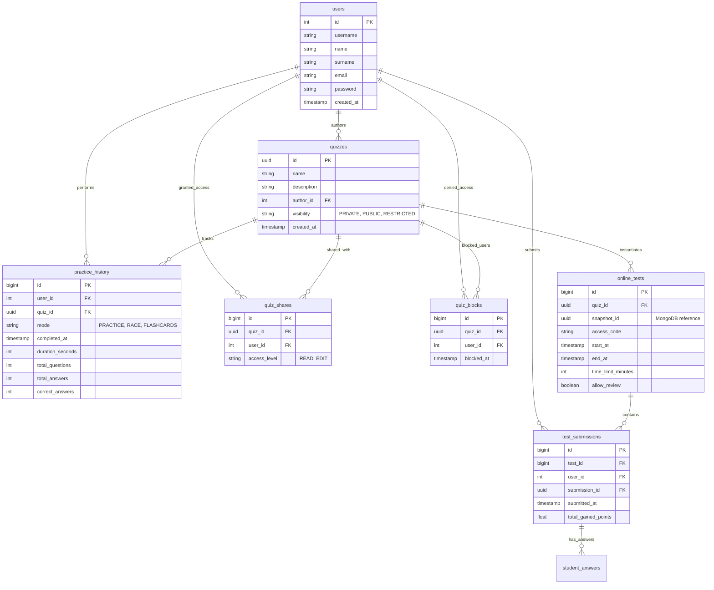

# 📱 EXAMO

A full-stack, feature-rich mobile quiz application designed for both students and teachers. Built as a monorepo combining a cross-platform mobile frontend with a backend.

## 🛠️ Tech Stack & Architecture

- **Frontend:** React Native + Expo (TypeScript, TanStack Query, Expo Router, MMKV)
- **Backend:** Spring Boot (Java/Kotlin, Spring Security, JWT, OAuth2)
- **Databases:**
  - **PostgreSQL:** For structured data (user accounts, authentication, exam history, analytics).
  - **MongoDB:** For schema-less quiz layouts, flexible question types (multiple-choice, open questions), and offline-ready JSON templates.

### 📊 PostgreSQL Database Schema

This database handles users, access management (sharing and blocking), test sessions, practice history and aggregated statistics.



### 🍃 MongoDB Collections (NoSQL Document Structure)

Since MongoDB stores schema-flexible BSON documents, we use it to handle the actual quiz content. This allows for rich question formats, dynamic answer options, and immutable test snapshots without duplicating massive amounts of text in PostgreSQL.

#### 1. The `quizzes` Collection

Stores the live, editable quiz definitions. The `_id` matches the `id` of the quiz in the PostgreSQL `quizzes` table.

```json
{
  "id": "UUID (Matches quizzes.id in Postgres)",
  "title": "Database Fundamentals",
  "link": "https://asdfasfd",
  "description": "Preparation for the final exam.",
  "categories": ["IT", "SQL", "Databases"],
  "authorId": 42,
  "updatedAt": "2026-06-19T18:15:00Z",
  "questions": [
    {
      "id": "q1",
      "type": "SINGLE_CHOICE",
      "questionText": "Which database is purely relational?",
      "options": [
        { "id": "1", "text": "MongoDB", "isCorrect": false },
        { "id": "2", "text": "PostgreSQL", "isCorrect": true },
        { "id": "3", "text": "Redis", "isCorrect": false }
      ],
      "maxPoints": 1.0,
      "negativePoints": 0.5
    },
    {
      "id": "q4",
      "type": "OPEN",
      "questionText": "Which SQL command is used to delete a table?",
      "options": [{ "id": "1", "text": "DROP TABLE", "isCorrect": true }],
      "maxPoints": 2.0,
      "negativePoints": 0.0,
      "imageUrl": "/images/test_UUID/q4.jpg"
    }
  ]
}
```

_Note on Scoring: If a question has negativePoints > 0, the frontend automatically appends a "Skip / Do not answer" option. Skipping a question yields exactly 0 points, overriding negative point deductions._

#### 2. The quiz_snapshots Collection

Immutable snapshots generated the moment a teacher launches a live online_test or generates a PDF. This ensures historical test records remain perfectly intact even if the author modifies the original quiz later.

```json
{
  "id": "UUID (Matches online_tests.snapshot_id in Postgres)",
  "originalQuizId": "UUID",
  "snapshotDate": "2026-06-20T10:00:00",
  "questions": [
    {
      "id": "q1",
      "type": "SINGLE_CHOICE",
      "questionText": "Which database is purely relational?",
      "options": [
        { "id": "1", "text": "MongoDB", "isCorrect": false },
        { "id": "2", "text": "PostgreSQL", "isCorrect": true },
        { "id": "3", "text": "Redis", "isCorrect": false }
      ],
      "maxPoints": 1.0,
      "negativePoints": 0.5
    }
  ]
}
```

_In PostgreSQL, the student_answers.question_id column maps directly to the inner id (e.g., "q1", "q2") of the questions inside this specific snapshot document._

## ✨ Key Features

- **Smart Learning:** Flashcards, Practice mode, and a timed Race mode.
- **Teacher Tools:** Automated PDF test generator with custom page layout and unique test IDs.
- **Seamless Sharing:** Instant quiz sharing via generated QR codes or deep links.
- **Offline First:** Local JSON/XML export and import capabilities using `expo-file-system`.

## Links

- Figma: [Examo](https://www.figma.com/design/IvHsNmpnB761eMDljY8AZ6/Untitled?node-id=0-1&p=f&t=jtLGXAnMlPA03DBp-0)
