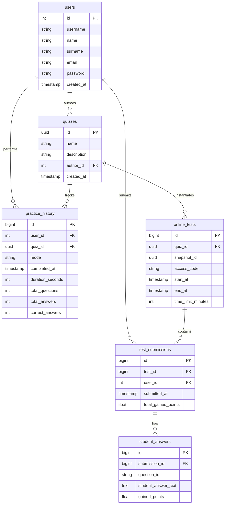

# 📱 EXAMO

A full-stack, feature-rich mobile quiz application designed for both students and teachers. Built as a monorepo combining a cross-platform mobile frontend with a backend.

## 🛠️ Tech Stack & Architecture

- **Frontend:** React Native + Expo (TypeScript, TanStack Query, Expo Router, MMKV)
- **Backend:** Spring Boot (Java/Kotlin, Spring Security, JWT, OAuth2)
- **Databases:**
  - **PostgreSQL:** For structured data (user accounts, authentication, exam history, analytics).
  - **MongoDB:** For schema-less quiz layouts, flexible question types (multiple-choice, open questions), and offline-ready JSON templates.

### 📊 PostgreSQL Database Schema

## ✨ Key Features

- **Smart Learning:** Flashcards, Practice mode, and a timed Race mode.
- **Teacher Tools:** Automated PDF test generator with custom page layout and unique test IDs.
- **Seamless Sharing:** Instant quiz sharing via generated QR codes or deep links.
- **Offline First:** Local JSON/XML export and import capabilities using `expo-file-system`.

