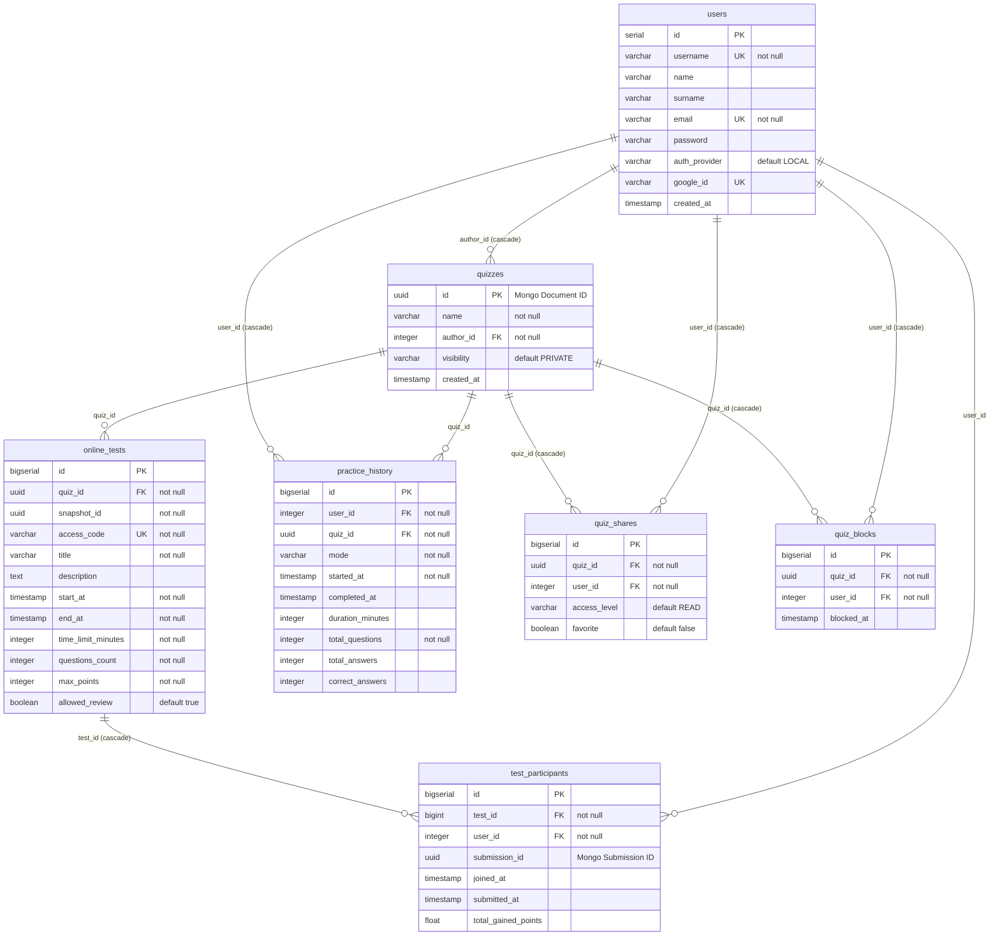

# 📱 EXAMO

A full-stack, feature-rich mobile quiz application designed for both students and teachers. Quizzes can be created directly within the app or uploaded and exported via JSON, XML, or CSV formats. Users can select a set of questions to practice normally, use a race mode with a question timer, or shuffle questions. Additional features include flagging specific questions to practice exclusively, displaying correct answers underneath for better learning, and linking user accounts to store created questions and share them so others can try the tests.

**Comprehensive Testing Systems:**

- **Online Tests:** Teachers can schedule live timed exams with start/end windows. Students join via access codes, and submissions are automatically graded and securely archived for 30 days for review and download.
- **Paper Tests (PDF Generation)**: Teachers can generate printable offline tests by specifying question counts, page layouts, and custom headers. Each printed test includes a unique identifier to prevent mix-ups.

**Advanced Sharing System:**

- Quizzes can be instantly shared and accessed via QR codes (with built-in camera scanning support) or direct deep links that automatically open the app and load the specific quiz set.

_Built as a monorepo combining a cross-platform mobile frontend with a backend._

> [!NOTE]
> **Project Status: Abandoned**
>
> This project is currently abandoned due to a lack of motivation and highly complex logic. I could have used more AI, but then this project would have lacked any meaning for me as a learning experience. At the very least, I was able to try mobile development in React Native and successfully work with a NoSQL database in combination with a standard SQL database. Unfortunately, I didn't get my hands on PDF creation, File manipulation and offline mode. Maybe I'll come back to this later (equipped with AI agents). The final roadblock I encountered was with the test creation and submission logic, which required complex algorithms and dealing with messy database data.

## 🛠️ Tech Stack & Architecture

This project was designed with a highly scalable, modern architectural vision. While paused, the intended stack reflects a robust enterprise-grade application:

### 🟢 Implemented Core Stack

- **Frontend:** React Native + Expo (TypeScript, TanStack Query, Expo Router, MMKV)
- **Backend:** Spring Boot (Java, Spring Security, JWT)
- **Relational Database:** PostgreSQL (For structured data: user accounts, authentication, exam history, analytics, and complex relationship mapping).
- **NoSQL Database:** MongoDB (For schema-less quiz layouts, flexible question types, and immutable test snapshots).
- **OAuth2 Integration:** Seamless social authentication (Google login) alongside standard JWT.
- **WebSockets:** Real-time synchronization for teacher-to-student test broadcasting.
- **QR Code Generation & Scanning:** Allowing students to instantly join a live test session by scanning a dynamically generated code on the teacher's screen.

### 🎯 Planned Technologies (The Full Vision)

These technologies were scoped and planned to complete the application's feature set:

- **PDF Generation:** Automated server-side export of quizzes into formatted PDF documents for offline, printable classroom tests.
- **File Manipulation & Offline Mode:** Leveraging `expo-file-system` to download JSON/XML test templates locally, allowing students to study and practice completely offline.

---

### 📊 PostgreSQL Database Schema

This database handles users, access management (sharing and blocking), test sessions, practice history and aggregated statistics.


```mermaid
erDiagram
    users {
        serial id PK
        varchar username UK "not null"
        varchar name
        varchar surname
        varchar email UK "not null"
        varchar password
        varchar auth_provider "default LOCAL"
        varchar google_id UK
        timestamp created_at
    }

    quizzes {
        uuid id PK "Mongo Document ID"
        varchar name "not null"
        integer author_id FK "not null"
        varchar visibility "default PRIVATE"
        timestamp created_at
    }

    online_tests {
        bigserial id PK
        uuid quiz_id FK "not null"
        uuid snapshot_id "not null"
        varchar access_code UK "not null"
        varchar title "not null"
        text description
        timestamp start_at "not null"
        timestamp end_at "not null"
        integer time_limit_minutes "not null"
        integer questions_count "not null"
        integer max_points "not null"
        boolean allowed_review "default true"
    }

    test_participants {
        bigserial id PK
        bigint test_id FK "not null"
        integer user_id FK "not null"
        uuid submission_id "Mongo Submission ID"
        timestamp joined_at
        timestamp submitted_at
        float total_gained_points
    }

    practice_history {
        bigserial id PK
        integer user_id FK "not null"
        uuid quiz_id FK "not null"
        varchar mode "not null"
        timestamp started_at "not null"
        timestamp completed_at
        integer duration_minutes
        integer total_questions "not null"
        integer total_answers
        integer correct_answers
    }

    quiz_shares {
        bigserial id PK
        uuid quiz_id FK "not null"
        integer user_id FK "not null"
        varchar access_level "default READ"
        boolean favorite "default false"
    }

    quiz_blocks {
        bigserial id PK
        uuid quiz_id FK "not null"
        integer user_id FK "not null"
        timestamp blocked_at
    }

    %% Relationships
    users ||--o{ quizzes : "author_id (cascade)"
    quizzes ||--o{ online_tests : "quiz_id"
    online_tests ||--o{ test_participants : "test_id (cascade)"
    users ||--o{ test_participants : "user_id"
    users ||--o{ practice_history : "user_id (cascade)"
    quizzes ||--o{ practice_history : "quiz_id"
    quizzes ||--o{ quiz_shares : "quiz_id (cascade)"
    users ||--o{ quiz_shares : "user_id (cascade)"
    quizzes ||--o{ quiz_blocks : "quiz_id (cascade)"
    users ||--o{ quiz_blocks : "user_id (cascade)"
```

### 🍃 MongoDB Collections (NoSQL Document Structure)

Since MongoDB stores schema-flexible BSON documents, we use it to handle the actual quiz content. This allows for rich question formats, dynamic answer options, and immutable test snapshots without duplicating massive amounts of text in PostgreSQL.

#### 1. The `quizzes` Collection

Stores the live, editable quiz definitions. The `_id` matches the `id` of the quiz in the PostgreSQL `quizzes` table.

```json
{
  "id": "UUID (Matches quizzes.id in Postgres)",
  "title": "Database Fundamentals",
  "shareHash": "SOME_Hash",
  "description": "Preparation for the final exam.",
  "categories": ["IT", "SQL", "Databases"],
  "authorId": 2,
  "author": "Artem Dev",
  "updatedAt": "2026-06-19T18:15:00Z",
  "questions": [
    {
      "id": "q1",
      "type": "SINGLE_CHOICE",
      "questionText": "Which database is purely relational?",
      "options": [
        { "id": "1", "text": "MongoDB", "isCorrect": false },
        { "id": "2", "text": "PostgreSQL", "isCorrect": true },
        { "id": "3", "text": "Redis", "isCorrect": false }
      ],
      "maxPoints": 1.0,
      "negativePoints": 0.5
    },
    {
      "id": "q4",
      "type": "OPEN",
      "questionText": "Which SQL command is used to delete a table?",
      "options": [{ "id": "1", "text": "DROP TABLE", "isCorrect": true }],
      "maxPoints": 2.0,
      "negativePoints": 0.0,
      "imageUrl": "/images/test_UUID/q4.jpg"
    }
  ]
}
```

_Note on Scoring: If a question has negativePoints > 0, the frontend automatically appends a "Skip / Do not answer" option. Skipping a question yields exactly 0 points, overriding negative point deductions._

#### 2. The `quiz_snapshots` Collection

Immutable snapshots generated the moment a teacher launches a live online_test or generates a PDF. This ensures historical test records remain perfectly intact even if the author modifies the original quiz later.

```json
{
  "id": "UUID (Matches online_tests.snapshot_id in Postgres)",
  "originalQuizId": "UUID",
  "snapshotDate": "2026-06-20T10:00:00",
  "questions": [
    {
      "id": "q1",
      "type": "SINGLE_CHOICE",
      "questionText": "Which database is purely relational?",
      "options": [
        { "id": "1", "text": "MongoDB", "isCorrect": false },
        { "id": "2", "text": "PostgreSQL", "isCorrect": true },
        { "id": "3", "text": "Redis", "isCorrect": false }
      ],
      "maxPoints": 1.0,
      "negativePoints": 0.5
    }
  ]
}
```

_In PostgreSQL, the student_answers.question_id column maps directly to the inner id (e.g., "q1", "q2") of the questions inside this specific snapshot document._

#### 3. The `test_sessions` (Active Tests) Collection

Tracks ongoing, active test attempts for users in real-time, holding state details, time constraints, and intermediate answer drafts.

```json
{
  "_id": "550e8400-e29b-41d4-a716-446655449999",
  "testId": 4,
  "userId": 2,
  "title": "Missing title",
  "status": "IN_PROGRESS",
  "startedAt": "2026-07-25T12:05:00Z",
  "expiresAt": "2026-07-25T12:35:00Z",
  "hardDeadline": "2026-07-25T14:00:00Z",
  "questions": [
    {
      "id": "q2",
      "type": "MULTIPLE_CHOICE",
      "questionText": "Which of these are core navigation types in React Navigation?",
      "options": [
        { "id": "1", "text": "Stack" },
        { "id": "2", "text": "Tab" },
        { "id": "3", "text": "Grid" }
      ],
      "maxPoints": 2,
      "negativePoints": 0.5,
      "imageUrl": "image.jpg"
    }
  ],
  "answers": {
    "q2": ["1", "2"]
  }
}
```

_Session is automatically deleted after student submits the test or the session time runs out. However I should also add cron checks to delete sessions, that were abondoned by users and not submitted. It would save some temporary memory on the server._

#### 4. Test `test_submissions` Collection

Stores finalized exam submissions, capturing individual student responses, exact point evaluations, and time logs for historical tracking and teacher audits.

```json
{
  "_id": "aaa14a2e-4b47-41ab-9b34-8c8511671aaa",
  "testId": 1,
  "userId": 2,
  "author": "azakhardev",
  "title": "Advanced React Patterns",
  "totalPointsGained": 1,
  "start": "2026-06-10T10:00:00Z",
  "submittedAt": "2026-06-10T10:45:00Z",
  "end": "2026-06-10T11:00:00Z",
  "answers": [
    {
      "id": "ans_aza_q1_adv",
      "gainedPoints": 1,
      "question": {
        "id": "q1",
        "type": "SINGLE_CHOICE",
        "questionText": "What hook is used for caching an expensive calculation?",
        "maxPoints": 1,
        "negativePoints": 0,
        "options": [
          { "id": "1", "text": "useMemo", "isCorrect": true },
          { "id": "2", "text": "useCallback", "isCorrect": false },
          { "id": "3", "text": "useEffect", "isCorrect": false }
        ]
      },
      "answer": [{ "text": "useMemo", "correct": true }]
    }
  ]
}
```

## ✨ Key Features

- **Smart Learning:** Flashcards, Practice mode, and a timed Race mode.
- **Teacher Tools:** Automated PDF test generator with custom page layout and unique test IDs.
- **Seamless Sharing:** Instant quiz sharing via generated QR codes or deep links.
- **Offline First:** Local JSON/XML export and import capabilities using `expo-file-system`.

## Links

- Figma: [Examo](https://www.figma.com/design/IvHsNmpnB761eMDljY8AZ6/Untitled?node-id=0-1&p=f&t=jtLGXAnMlPA03DBp-0)

## Possible Improvements

- Adding pagination
- Autograder based on points criteria
- Cleaner components & use of orval with openapi

## ⏱️ Development Log

**Total Time Invested: ~75 hours**

<details>
<summary>Click to view the day-by-day progress</summary>

| Date      | Time Spent | Focus / Milestone                                         |
| :-------- | :--------- | :-------------------------------------------------------- |
| **19.6.** | 3h         | Project initialization & DB schema                        |
| **20.6.** | 2.5h       | Error handling & Login                                    |
| **21.6.** | 3h         | Figma prototyping & MongoDB setup                         |
| **22.6.** | 2h         | Figma prototyping & library research                      |
| **23.6.** | 3.5h       | Figma prototyping & basic layout implementation           |
| **25.6.** | 1h         | Detail page                                               |
| **26.6.** | 2h         | Figma prototyping & Profile Page                          |
| **27.6.** | 3h         | Figma prototyping & Quiz Detail Page                      |
| **28.6.** | 45m        | Figma - Access management                                 |
| **30.6.** | 1.25h      | Figma - Quiz test                                         |
| **1.7.**  | 5h         | Manage Access Screen, Figma, Edit Screen & Layout         |
| **2.7.**  | 3.5h       | Edit Quiz (React Hook Form)                               |
| **3.7.**  | 2h         | Quiz test screen & live test screen                       |
| **5.7.**  | 2.25h      | Practice screen, Test Results & Create test               |
| **7.7.**  | 1.5h       | Join Test & Participate During Test                       |
| **8.7.**  | 2.5h       | Authentication provider, review screen & edit test screen |
| **10.7.** | 1.5h       | Practice Screen (WIP)                                     |
| **11.7.** | 1h         | Practice Screen (Finished)                                |
| **12.7.** | 2h         | Login page & fetch setup                                  |
| **17.7.** | 2.5h       | Quizzes API endpoints                                     |
| **18.7.** | 2h         | Frontend/Backend Filtering, datafix ("no AI" day)         |
| **19.7.** | 2h         | Profile endpoints & Quiz Detail                           |
| **21.7.** | 3.5h       | Data Access management & Favorite toggle                  |
| **23.7.** | 3h         | Foreign tests listing & Detail page                       |
| **24.7.** | 1.75h      | Foreign tests data fetch + Join endpoint                  |
| **25.7.** | 1.75h      | Test Sessions implementation                              |
| **31.7.** | 1.5h       | Generate Test endpoint                                    |
| **14.8.** | 5h         | Submit Test endpoint & Create Unique Test Entity          |
| **18.8.** | 2.5h       | Google OAuth (Works in web only)                          |
| **19.8.** | 3h         | WebSockets                                                |
| **20.8.** | 2h         | Create & Edit Quiz                                        |
| **21.8.** | 3.5h       | Joining Quizzes via links or QR codes                     |
| **22.8.** | 1.5h       | Quiz Download                                             |

</details>
